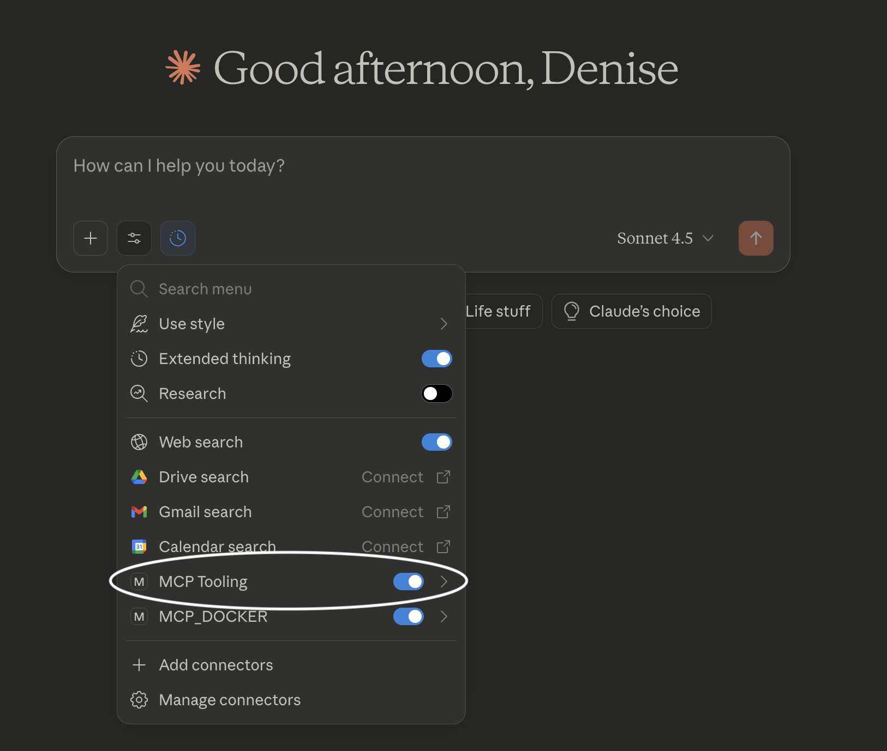
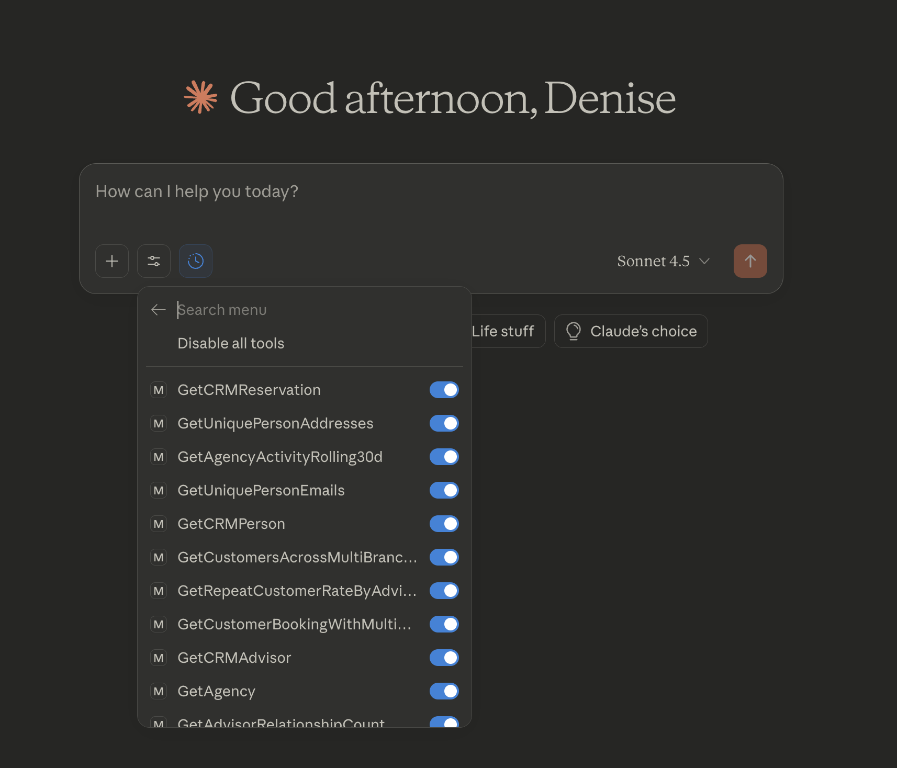

# DataSQRL Use Cases and Examples

This is a repository for real world [DataSQRL](https://github.com/DataSQRL/sqrl) use cases and examples.

* **[Finance Credit Card Chatbot](finance-credit-card-chatbot)**: Build a data pipeline that enriches and analyzes credit card transaction in real time and feeds the data into a GenAI chatbot to answer customer's questions about their transactions and spending. The extended example shows how to build a credit card rewards program and GenAI agent that sells credit cards.
* **[Clickstream AI Recommendation](clickstream-ai-recommendation)**: Build a personalized recommendation engine based on clickstream data and vector content embeddings generated by an LLM.
* **[Healthcare Study](healthcare-study)**: Build a data pipeline for enriching healthcare data and querying it in realtime through an API, for data analytics in Iceberg, and publishing it to Kafka.
* **[Law Enforcement](law-enforcement)**: Build a realtime data pipeline for capturing and tracking warrants and Bolos.
* **[Oil & Gas IoT Automation Agent](oil-gas-agent-automation)**: Build a realtime data enrichment pipeline that triggers an agent to analyze abnormal events for automated troubleshooting.
* **[IoT Sensor Metrics](iot-sensor-metrics)**: Build an event-driven microservice that ingests sensor metrics, processes them in realtime, and produces alerts and dashboards for users.
* **[Logistics Shipping](logistics-shipping-geodata)**: Build a data pipeline that processes logistics data to provide real-time tracking and shipment information for customers.
* **[User Defined Function](user-defined-function)**: This small tutorial shows how to include your call a custom function in your SQRL script.

## Getting Started

### Prerequisites

**Required for all examples:**
- [Docker](https://docs.docker.com/get-docker/) - Recent version installed and running

**Required for Claude Desktop integration (optional):**
- [Node.js and npm](https://nodejs.org/) - For MCP server support
- [Claude Desktop](https://claude.ai/download) - For MCP integration

### Running Examples

1. **Navigate to an example directory:**
   ```bash
   cd <example-directory>
   ```

2. **Compile the SQRL file** (generates package configuration):
   ```bash
   docker run --rm -v $PWD:/build datasqrl/cmd:latest compile <your-sqrl-file>.sqrl
   ```

3. **Run the example:**
   ```bash
   docker run -it --rm -p 8888:8888 -p 8081:8081 -p 9092:9092 -v $PWD:/build datasqrl/cmd:latest run <your-sqrl-file>.sqrl
   ```

   The `datasqrl/cmd` image will be pulled automatically if not present locally.

4. **Verify the server is running:**
   Look for these log messages:
   ```
   HTTP server listening on port 8888
   ```

   The server is now accessible at:
   - GraphQL API: http://localhost:8888
   - Swagger UI: http://localhost:8888/v1/swagger-ui
   - Swagger JSON: http://localhost:8888/v1/swagger

**Note:** Check the `README.md` in each example directory for specific arguments and configuration. On Windows PowerShell, use `${PWD}` instead of `$PWD`.

### Claude Desktop Integration (Optional)

DataSQRL can expose its APIs to Claude Desktop via MCP (Model Context Protocol), enabling Claude to interact with your data pipelines directly.

#### Setup

1. **Configure Claude Desktop MCP Server:**
   - Open Claude Desktop
   - Navigate to Settings → Developer Settings
   - Click Edit Config to open `claude_desktop_config.json`
   - Add the MCP server configuration:
     ```json
     {
       "globalShortcut": "Alt+C",
       "mcpServers": {
         "MCP Tooling": {
           "command": "mcp-remote",
           "args": [
             "http://localhost:8888/v1/mcp"
           ]
         }
       }
     }
     ```
   - Save and restart Claude Desktop completely

2. **Start the DataSQRL server** (see "Running Examples" above)

3. **Verify MCP connection:**
   - Open Claude Desktop (restart if it was running during configuration)
   - Start a new chat session
   - Open the tools menu (settings icon at bottom left of input field)
   - Verify **MCP Tooling** appears in the server list with enabled toggles
   - Expand **MCP Tooling** to view available DataSQRL tools

   
   

All DataSQRL tools defined in your SQRL file are exposed via MCP. Available tools depend on your schema and query definitions.

#### Troubleshooting

**MCP Server Not Appearing:**
- Open Claude Desktop → Settings → Developer Settings → See Logs
- Review logs for connection errors
- Common issues: incorrect endpoint URL, server not running, or configuration syntax errors

**Port 8888 Already in Use:**
- Identify process: `lsof -i :8888`
- Stop conflicting service or change port mapping: `-p 8889:8888`
- Update MCP config endpoint to: `http://localhost:8889/v1/mcp`

**MCP Server Connection Failed:**
- Verify container is running: `docker ps`
- Check server logs for "HTTP server listening on port 8888"
- Confirm MCP endpoint URL matches config: `http://localhost:8888/v1/mcp`
- Restart Claude Desktop after configuration changes

## What is DataSQRL?

Check out the main [DataSQRL repository](https://github.com/DataSQRL/sqrl/) for more information on the compiler and runtime used in these examples.

Take a look at the [DataSQRL documentation](https://datasqrl.github.io/sqrl) to learn how to build your own project with DataSQRL.
