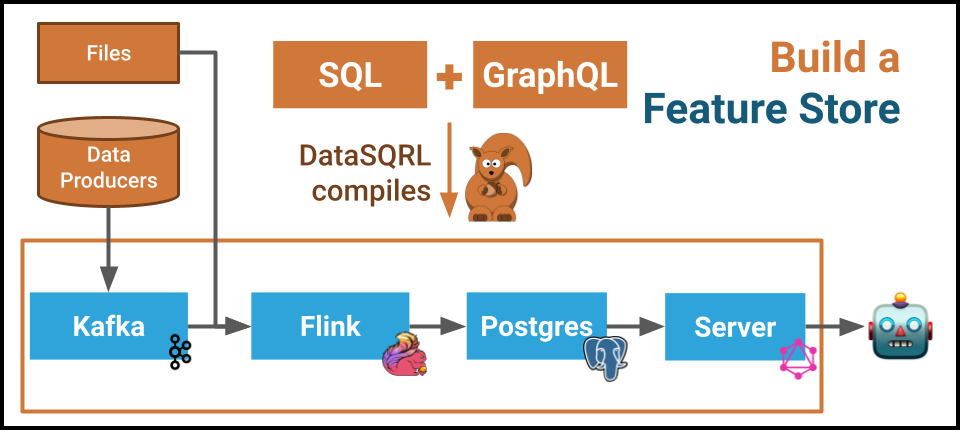

# DataSQRL Use Cases and Examples

This is a repository for real world [DataSQRL](https://github.com/DataSQRL/sqrl) use cases and examples.

* **[Finance Credit Card Chatbot](finance-credit-card-chatbot/)**: Build a data pipeline that enriches and analyzes credit card transaction in real time and feeds the data into a GenAI chatbot to answer customer's questions about their transactions and spending. The extended example shows how to build a credit card rewards program and GenAI agent that sells credit cards.
* **[Clickstream AI Recommendation](clickstream-ai-recommendation/)**: Build a personalized recommendation engine based on clickstream data and vector content embeddings generated by an LLM.
* **[IoT Sensor Metrics](iot-sensor-metrics/)**: Build an event-driven microservice that ingests sensor metrics, processes them in realtime, and produces alerts and dashboards for users.
* **[Logistics Shipping](logistics-shipping-geodata/)**: Build a data pipeline that processes logistics data to provide real-time tracking and shipment information for customers.
* **[Retail Nutshop](retail-customer360-nutshop/)**: Build a realtime Customer 360 application for an online shop with personalized recommendations.
* **[User Defined Function](user-defined-function/)**: This small tutorial shows how to include your call a custom function in your SQRL script.

## Running the Examples

### Prerequisites

Running these examples requires the DataSQRL compiler. The easiest way to run the DataSQRL compiler is in Docker. This requires that you have a [recent version of Docker](https://docs.docker.com/get-docker/) installed on your machine.

### Compiling Examples

To run the DataSQRL compiler on Linux or MacOS, open a terminal and run the following command:
```bash
docker run -it --rm -v $PWD:/build datasqrl/cmd:latest compile [ARGUMENTS GO HERE]
```

If you are on windows using Powershell, you need to reference the local directory with a slightly different syntax:
```bash
docker run -it --rm -v ${PWD}:/build datasqrl/cmd:latest compile [ARGUMENTS GO HERE]
```

Check the `README.md` in the respective directory for more information on how to run each example. We will be using the Unix syntax, so keep in mind that you have to adjust the commands slightly on Windows machines by using `${PWD}` instead.

### Running Examples

DataSQRL compiles all the assets for a completely integrated data pipeline. The assets are generated in the `build/deploy` folder. You can run that data pipeline with Docker:

`(cd build/deploy; docker compose up --build)`.

This will build all the images and stand up all the components of the data pipeline. Note, that this can take a few minutes - in particular if you are building for the first time.

Once you are done with the data pipeline, you can bring it down safely with:

`(cd build/deploy; docker compose down -v)`

## What is DataSQRL?



DataSQRL is a flexible data development framework for building various types of data architectures, like data pipelines, event-driven microservices, and Kappa. It provides the basic structure, common patterns, and a set of tools for streamlining the development process.

DataSQRL integrates a broad array of technologies including Apache Flink, Apache Kafka, PostgreSQL, Apache Iceberg, Snowflake, Vert.x and others. By enabling developers to define data processing workflows in SQL and supporting custom functions in Java, Scala, and soon Python, DataSQRL generates the necessary glue code, schematics, and mappings to connect and configure these components seamlessly. DataSQRL simplifies the data engineering process by automating routine tasks such as testing, debugging, deployment, and maintenance of data architectures.

[DataSQRL](https://github.com/DataSQRL/sqrl) is an open-source project hosted on GitHub.
[Click here](https://www.datasqrl.com) for more information and documentation on DataSQRL.