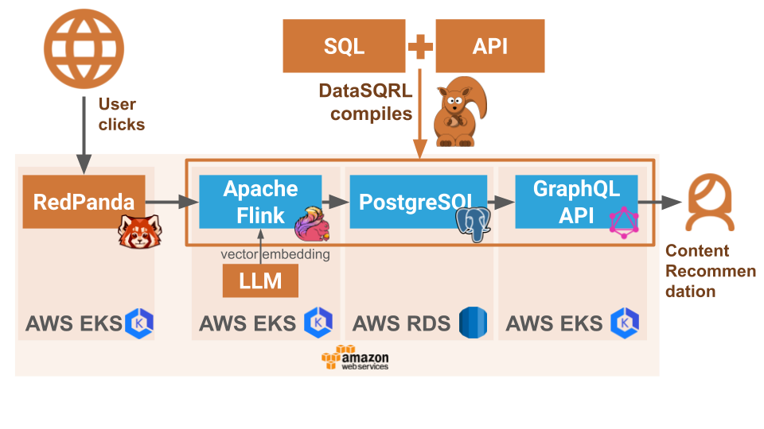

# Clickstream Recommendation

> ⚠️ **Warning:** This example has not yet been updated to 0.6 and uses an older version of DataSQRL

This example demonstrates DataSQRL's capabilities by creating personalized content recommendations
based on clickstream data and content vector embeddings. The pipeline ingests data, processes it,
and serves recommendations in real time, highlighting the power of DataSQRL in handling streaming
data efficiently.

## Architecture

The data pipeline ingests content and clickstream data into Redpanda, processes the data with Flink
to compute recommendations, stores the recommendations in Postgres, and serves them on request
through the GraphQL API.



You can run this entire data pipeline locally as explained below. You can also deploy the individual
components in AWS as shown in the diagram above.

## How to Compile and Run the Project

There are two ways to run this example depending on how you want to ingest the clickstream data.

### Ingest from Stream

This method reads data from the stream directly and requires that you add the data to the stream
specifically.

In the project, we have two packages for the same data. The `content-kafka` package specifies reading
data through a Kafka connector. The `content-file`, uses a connector that reads from the
filesystem. Initially, we will use the `content-kafka` package, which is already
imported (`IMPORT content.Content`, which has a dependency aliased in the package.json).

Then, execute the following steps:

1. Run the following command in the root directory to compile: `docker run -it --rm -v $PWD:/build datasqrl/cmd:v0.5.2 compile`
1. Add the current directory as an env variable: `export SQRL_DIR=${PWD}`
1. Start the pipeline: `(cd build/deploy; docker compose up --build)`. This sets up the entire data pipeline with
   Redpanda, Flink, Postgres, and API server. It takes a few minutes for all the components to boot
   up.
1. Once everything is started, open another terminal window to add data to Kafka using the
   load_data.py script in the `yourdata-files` directory. This requires **kafka-python-ng** installed
   via `pip3 install kafka-python-ng`.
1. Load the content data: `python3 load_data.py content.json.gz localhost:9094 content --msg 50`.
   Wait until it finishes, which takes about two minutes. Check the Flink Dashboard running
   at http://localhost:8081/ to see the progress. Wait until the task turns blue again.
1. Load the clickstream
   data: `python3 load_data.py clickstream.json.gz localhost:9094 clickstream --msg 100`. This loads
   100 clicks per second. Wait a few seconds for some data to load. Let this run in the background
   until it finishes (about 4 minutes).

Open GraphiQL and query the data:
`http://localhost:8888/graphiql/`

Query for recommendations either by page:

```graphql
query {
    Recommendation(url: "https://en.wikipedia.org/wiki/Generosity%3A%20An%20Enhancement") {
        recommendation
        frequency
    }
}
```

or for a user:

```graphql
query {
    SimilarContent(userid: "f5e9c688-408d-b54f-94aa-493df43dac8c") {
        url
        similarity
    }
}
```

You can find all the page URLs in the file `datawiki/wikipedia_urls.txt` and user ids in the
file `yourdata-files/clickstream.json.gz` (read it with `gzcat`) if you want to experiment with
different queries.

Once you are done, hit `CTRL-C` and take down the pipeline containers with `docker compose down -v`.

### From Local Files and API

This method reads the content data from local files and ingests the clickstream data through the
API. Please look at the `package-mutation.json` and compare it with the `package.json` we used before.
Notice that we are using different graphql files and different dependencies.

Execute the following steps:

1. Run the following command in the root directory to compile: `docker run -it --rm -v $PWD:/build datasqrl/cmd:v0.5.2 compile -c package-mutation.json`
2. Navigate to the build/deploy directory: `(cd build/deploy; docker compose up --build)`

Open GraphiQL to add and query data.

First, add some clickstream data for the user with ID f5e9c688-408d-b54f-94aa-493df43dac8c by
running the following mutations one after the other. Each mutation simulates a user clicking on a
specific URL. We expect the system to record these clicks and use them to generate personalized
recommendations.

Open GraphiQL to execute the following graphql commands:
`http://localhost:8888/graphiql/`

This mutation records a click event for the user on the page "Generosity: An Enhancement":

```graphql
mutation {
    Clickstream(click: {userid: "f5e9c688-408d-b54f-94aa-493df43dac8c",
        url: "https://en.wikipedia.org/wiki/Generosity%3A%20An%20Enhancement"}) {
        event_time
    }
}
```

This mutation records another click event for the user on the page "Lock's Quest":

```graphql
mutation {
    Clickstream(click: {userid: "f5e9c688-408d-b54f-94aa-493df43dac8c",
        url: "https://en.wikipedia.org/wiki/Lock%27s%20Quest"}) {
        event_time
    }
}
```

his mutation records a final click event for the user on the page "SystemC":

```graphql
mutation {
    Clickstream(click: {userid: "f5e9c688-408d-b54f-94aa-493df43dac8c",
        url: "https://en.wikipedia.org/wiki/SystemC"}) {
        event_time
    }
}
```

Now, query for recommendations. Either by page:

This query provides recommendations based on the specified page URL:

```graphql
query {
    Recommendation(url: "https://en.wikipedia.org/wiki/Generosity%3A%20An%20Enhancement") {
        recommendation
        frequency
    }
}
```

This query provides recommendations based on the user's clickstream data, showing similar content to
what the user has interacted with:

```graphql
query {
    SimilarContent(userid: "f5e9c688-408d-b54f-94aa-493df43dac8c") {
        url
        similarity
    }
}
```

Once you are done, hit CTRL-C and take down the pipeline containers with docker compose down -v.
